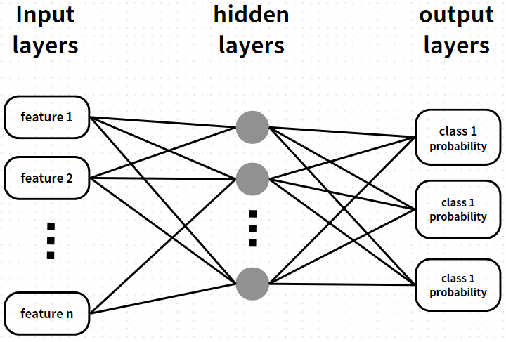
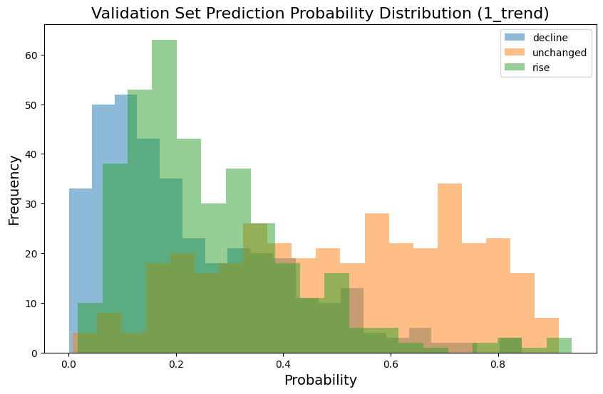
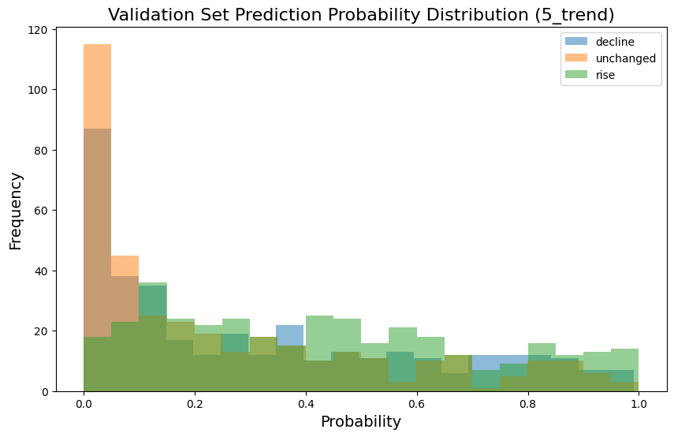
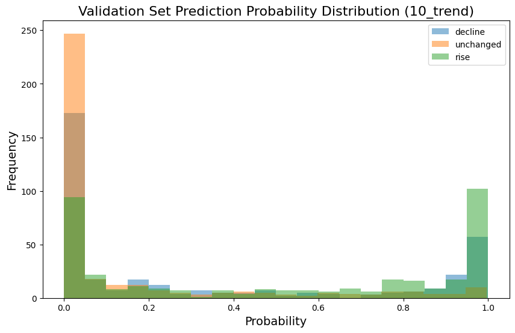
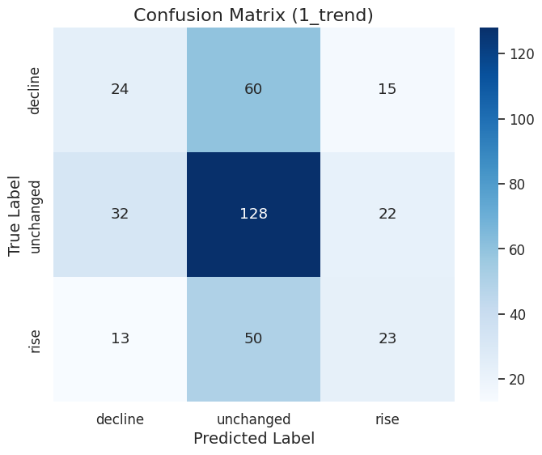
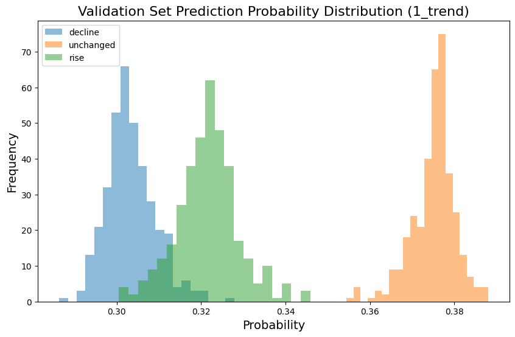
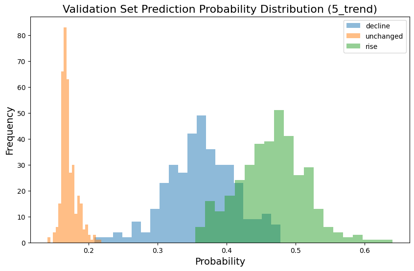
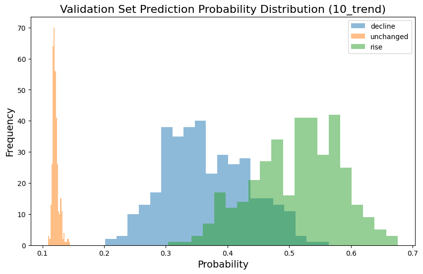
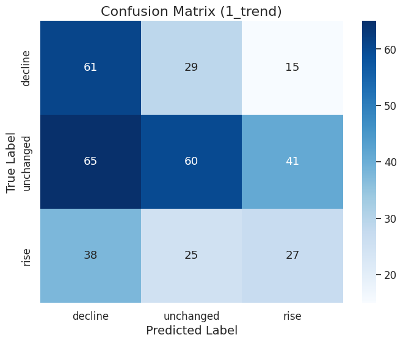

# 操作方法

* 我幾乎都打在裡面的markdown中，所以只要照著說明跑就好了

! 注意，因為前後的程式片段有相關聯，所以一定要照著順序跑，不然會出問題

# 檔案說明

> [!NOTE] 附註
> 這是兩個預測模型的不同的實作方法，而非結合SVM和MLP的模型  
> ( 但想要也是可以，可以多建構一個隱藏層，之後使用隱藏層2的輸出作為SVM的參數 )


* `MLP_main.ipynb` 採用MLP的方法來建構模型<br/>



* `SVM_main.ipynb` 採用SVM的方法來建構模型


# 測試結果

## `MLP_main.ipynb`

* f1值結果

```
1d
Train f1: 0.7450262981306207
Validation f1: 0.40343552946292677

              precision    recall  f1-score   support
           0       0.35      0.24      0.29        99
           1       0.54      0.70      0.61       182
           2       0.38      0.27      0.32        86

    accuracy                           0.48       367
   macro avg       0.42      0.40      0.40       367
weighted avg       0.45      0.48      0.45       367

5d
Train f1: 0.8085220772472086
Validation f1: 0.3791252453405222

              precision    recall  f1-score   support
           0       0.42      0.39      0.41       127
           1       0.30      0.28      0.29        93
           2       0.42      0.46      0.44       147

    accuracy                           0.39       367
   macro avg       0.38      0.38      0.38       367
weighted avg       0.39      0.39      0.39       367

10d
Train f1: 0.34176800029536786
Validation f1: 0.3355954729423097

              precision    recall  f1-score   support
           0       0.53      0.42      0.47       148
           1       0.21      0.16      0.18        63
           2       0.47      0.60      0.53       156

    accuracy                           0.45       367
   macro avg       0.40      0.39      0.39       367
weighted avg       0.45      0.45      0.44       367
```

* 機率長條圖





* confusion matrix




## `SVM_main.ipynb`

* f1值結果

```
Report for 1_trend:
              precision    recall  f1-score   support
        -1.0       0.37      0.58      0.45       105
         0.0       0.53      0.36      0.43       166
         1.0       0.33      0.30      0.31        90

    accuracy                           0.41       361
   macro avg       0.41      0.41      0.40       361
weighted avg       0.43      0.41      0.41       361
---------------------------------------------------
Report for 5_trend:
              precision    recall  f1-score   support
        -1.0       0.58      0.50      0.54       129
         0.0       0.29      0.25      0.27        83
         1.0       0.59      0.69      0.64       149

    accuracy                           0.52       361
   macro avg       0.48      0.48      0.48       361
weighted avg       0.51      0.52      0.52       361
---------------------------------------------------
Report for 10_trend:
              precision    recall  f1-score   support
        -1.0       0.81      0.70      0.75       149
         0.0       0.36      0.22      0.27        60
         1.0       0.66      0.85      0.74       152

    accuracy                           0.68       361
   macro avg       0.61      0.59      0.59       361
weighted avg       0.67      0.68      0.67       361
```

* 機率長條圖





* confusion matrix




